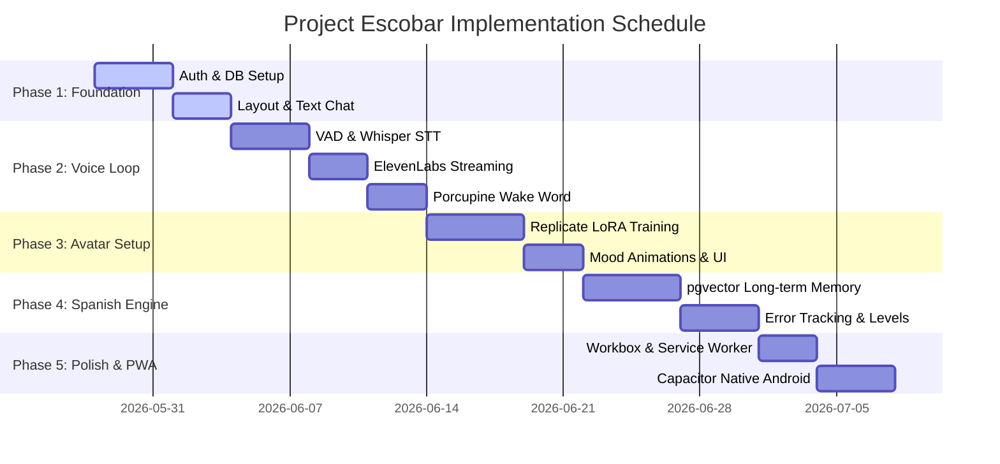

# Project Escobar — Stage 7 Implementation Plan
**Version 1.0**  |  **May 2026**
**Stage 7 of 8 — Build Workflow**

This document defines the complete phased build sequence, technical task breakdowns, and verification strategies for Project Escobar. It is designed to guide the AI Coding Agent through the development of the application, ensuring adherence to the security models (Supabase RLS) and design specifications (rose pink/cream UI) defined in the documentation.

---

## 1. Plan Overview & Core Architecture

Project Escobar is a Progressive Web App (PWA) with a React (Vite) frontend, a thin serverless backend deployed via Vercel, and a PostgreSQL database powered by Supabase.

### 1.1 Core Architecture Stack
* **Frontend**: React (TypeScript) + Vite + Tailwind CSS
* **Backend**: Node.js/Express (Vercel serverless functions) + Supabase Edge Functions
* **AI Orchestration**: Anthropic Claude Sonnet API
* **Speech-to-Text (STT)**: OpenAI Whisper API (`whisper-1`)
* **Text-to-Speech (TTS)**: ElevenLabs Streaming API
* **Wake Word**: Picovoice Porcupine Web SDK
* **Database**: PostgreSQL (Supabase) + pgvector (semantic memory)
* **Storage**: Supabase Storage (`avatar-images` and `audio-cache` buckets)

---

## 2. Security & Design Guidelines (Non-Negotiable)

### 2.1 Supabase RLS Policies
All database tables must have Row Level Security (RLS) enabled. The coding agent must strictly apply the following policies:
* **Profiles**: Users can read and update only their own profile (`auth.uid() = id`).
* **Conversations & Messages**: Isolation enforced via `auth.uid() = user_id`.
* **Memories & Errors**: Isolation enforced via `auth.uid() = user_id`.
* **Storage Buckets**: Access to the `avatar-images` and `audio-cache` buckets must restrict CRUD operations to folders named with the user's UUID (`auth.uid()::text`).
* **Service Role Bypass**: Only async system processes (like the memory embedding edge function) may bypass RLS using the `SUPABASE_SERVICE_ROLE_KEY`. This key must never be exposed to the client.

### 2.2 UI Color Palette & Design Tokens
All UI components must use custom CSS/Tailwind variables mapped to the following color codes:
* **Warm Cream (Background)**: `#FFF8F0`
* **Rose Pink (Primary)**: `#F25C8A` (Buttons, active states, accent borders)
* **Sunset Coral (Secondary)**: `#FF8C69` (User chat bubbles, secondary highlights)
* **Golden Honey (Accent)**: `#FFB347` (Level badges, warnings, success states)
* **Deep Espresso (Body Text)**: `#2C1810` (Primary typography)
* **Blush Pink (Card Surface)**: `#FAD4E0` (Card fills)
* **Light Pink (Hover Surface)**: `#FFF0F5` (Button hovers)
* **Glassmorphism Cards**: White (`#FFFFFF`) at `72%` opacity with a translucent border `rgba(242, 92, 138, 0.22)` and a `12px` backdrop blur.

---

## 3. Phased Implementation Milestones



---

### Phase 1: Foundation (Auth, Layout & Text Chat)
**Milestone**: Establish the foundational database schema, configure Supabase Authentication, set up global CSS/Tailwind custom variables, build out the responsive layout, and implement a streaming text chat interface with Claude Sonnet.

* **Target Files**:
  * `000_extensions.sql` (Supabase migrations)
  * `001_profiles.sql` (Profiles table schema + trigger)
  * `002_conversations.sql` (Conversations table)
  * `003_messages.sql` (Messages table + conversation timestamp bump trigger)
  * `src/screens/ChatScreen.tsx` (Decoupled chat thread tab view)
  * `src/index.css` (Base design token setup)
  * `src/context/AuthContext.tsx` (Session management)
  * `src/screens/Login.tsx` (Google & Magic Link Auth)
  * `src/screens/Onboarding.tsx` (Assessment quiz & user onboarding flow)
  * `src/screens/Home.tsx` (Tab shell containing navigation bar)
  * `api/chat.ts` (Claude Sonnet streaming orchestrator)

#### AI Coding Agent Tasks:
1. **Database Schema Setup**:
   * Create and run migrations `000_extensions.sql` (enabling `uuid-ossp`, `vector`, and `pg_trgm` extensions, and creating the helper `update_updated_at()`), `001_profiles.sql`, `002_conversations.sql`, and `003_messages.sql` in the Supabase SQL editor.
   * Enable RLS on all tables and verify security policies.
   * Verify that the database trigger automatically inserts public profile rows on user signup.
2. **Styling & Color Token Bindings**:
   * Add custom CSS properties for colors and fonts to `src/index.css` using the specified hex values.
   * Load Google Fonts *DM Serif Display* and *Nunito* in `index.html`.
3. **Authentication & Onboarding Gate**:
   * Update `src/context/AuthContext.tsx` to handle authentication states.
   * Enforce route protection: if a user is authenticated but has the default profile display name `'Maje'`, redirect them to `/onboarding` to set up their profile.
   * Implement Step 2 (SCR-03) in `Onboarding.tsx`: A 3-question multiple-choice Spanish assessment quiz (Q1: vocabulary, Q2: conjugation, Q3: ser/estar). Save the resulting score level (1-10) and user's chosen display name to the `profiles` table. Add a "Saltar" (Skip) button that sets the default level to 1.
4. **Layout Navigation Shell**:
   * Refactor `Home.tsx` to serve as a clean navigation tab shell. Create the bottom navigation items matching the design specifications.
   * Route the `'chat'` tab to render `ChatScreen.tsx`.
   * Create skeleton files for `'habla'`, `'progreso'`, and `'config'` tabs so the app doesn't crash on tab switching.
5. **Text Chat & Claude Orchestration**:
   * Create `src/screens/ChatScreen.tsx` to display the scrollable chat history.
   * Revise the `api/chat.ts` serverless function to accept user text input, retrieve the last 20 messages for context, call the Claude Sonnet streaming API, parse the JSON response delta on-the-fly, stream the parsed delta content to the client via Server-Sent Events, and save the assistant response to the `messages` table.

---

### Phase 2: Core Voice-Interaction Loop (STT, TTS & Wake Word)
**Milestone**: Prioritize hands-free voice interaction. Build a recording pipeline with Voice Activity Detection (VAD), proxy APIs for OpenAI Whisper and ElevenLabs, wake-word recognition, and assemble them into a continuous voice loop (Habla Conmigo mode).

* **Target Files**:
  * `src/hooks/useAudioRecorder.ts` (Audio recording + VAD)
  * `src/hooks/usePorcupine.ts` (Picovoice wake word wrapper)
  * `api/voice/transcribe.ts` (Whisper STT proxy)
  * `api/voice/speak.ts` (ElevenLabs TTS proxy)
  * `src/screens/VoiceScreen.tsx` (Full-screen voice mode view)
  * `src/screens/Home.tsx` (Tab navigation integration)

#### AI Coding Agent Tasks:
1. **Client-side Audio Capture & VAD**:
   * Implement `useAudioRecorder.ts` using the browser's Web Audio API and `MediaRecorder`.
   * Configure an `AnalyserNode` to perform real-time volume analysis. Implement VAD to automatically stop recording after 1.5 seconds of silence (below threshold).
2. **STT Transcription Proxy**:
   * Create `/api/voice/transcribe` to accept the WebM/Opus audio blob, convert to MP3, and call the OpenAI Whisper API. Include a default prompt parameter with Spanish caliche words to improve transcription accuracy.
3. **Streaming TTS Proxy & Cache**:
   * Create `/api/voice/speak` to send text to ElevenLabs. Stream the resulting MPEG audio buffer back to the client using the `eleven_multilingual_v2` model and the warm Honduran feminine voice ID.
   * Integrate caching: save generated audio for common short phrases (e.g. greeting, basic corrections) in the `audio-cache` Supabase storage bucket to minimize latency and subscription costs.
4. **Porcupine Wake Word Integration**:
   * Implement `usePorcupine.ts` to run Picovoice Porcupine inside a Web Worker. Configure it with the keyword `'Escobar'`.
   * Set up listener callbacks: when the wake word is detected, trigger the microphone recording.
5. **Full Voice Loop Orchestration**:
   * Build the `VoiceScreen.tsx` view (Habla Conmigo screen, SCR-06) containing a visual waveform animation and a state indicator (IDLE, LISTENING, THINKING, SPEAKING).
   * Construct the end-to-end loop: Wake word detected -> VAD Recording -> STT API -> Claude Sonnet -> ElevenLabs Stream -> Web Audio Chunked Playback -> Automatically resume wake word monitoring.

---

### Phase 3: Avatar Setup & Generation Pipeline
**Milestone**: Enable photo-to-avatar generation utilizing the Replicate API (Flux LoRA fine-tuning), store mood assets in Supabase Storage, and render the animated avatar in the UI with dynamic expression transitions.

* **Target Files**:
  * `006_avatar_assets.sql` (Avatar tracking table)
  * `api/avatar/generate.ts` (Replicate LoRA trigger)
  * `api/avatar/status.ts` (Replicate polling status)
  * `src/components/Avatar.tsx` (Animated visual avatar component)
  * `src/screens/AvatarStudio.tsx` (Upload and management studio)
  * `src/screens/Onboarding.tsx` (Onboarding Step 3 integration)

#### AI Coding Agent Tasks:
1. **Upload Form & Storage Policies**:
   * Execute migration `006_avatar_assets.sql`.
   * Create the `avatar-images` bucket in Supabase Storage. Set RLS policies so users can only write/read files within a folder named after their user ID.
   * Implement the upload UI inside `Onboarding.tsx` (Step 3, SCR-04) and `AvatarStudio.tsx` (SCR-10) to collect 5–10 user photos.
2. **Replicate LoRA Training Pipeline**:
   * Build `/api/avatar/generate` to trigger the Replicate `flux-dev-lora-trainer` training job asynchronously, passing the uploaded photo URLs.
   * Build the `/api/avatar/status` endpoint to allow client-side polling of training status.
3. **Asset Generation & Database Storage**:
   * Once training completes, call Replicate image generation to generate 4 distinct mood expressions (playful, affectionate, excited, annoyed) using defined prompt templates.
   * Upload the output images to the `avatar-images` storage bucket and save the public URLs to the `avatar_assets` database table.
4. **Avatar Rendering & Animation**:
   * Build the `Avatar.tsx` component. Implement an idle breathing animation (subtle scale change via CSS keyframes) and a glowing pulse effect during microphone capture.
   * Connect avatar state updates to Claude's response. When a new assistant message arrives, read the returned JSON `"mood"` parameter and crossfade the avatar image (400ms transition) to match the state.

---

### Phase 4: Spanish Learning Engine & Long-Term Memory
**Milestone**: Set up long-term memory via pgvector, deploy Deno Edge Functions for semantic search and async background memory synthesis, track user grammar errors, and implement assessed Spanish levels.

* **Target Files**:
  * `004_memories.sql` (memories table schema + similarity RPC)
  * `005_spanish_errors.sql` (spanish_errors table schema + upsert routine)
  * `supabase/functions/embed-memory/index.ts` (Deno Edge Function)
  * `src/screens/ProgresoScreen.tsx` (Progreso tab UI, SCR-07)
  * `src/screens/SettingsScreen.tsx` (Config tab UI settings screen, SCR-08)
  * `src/screens/MemoryVault.tsx` (Settings memory management, SCR-11)
  * `src/screens/ScenarioMode.tsx` (Role-play scenario routing, SCR-09)

#### AI Coding Agent Tasks:
1. **pgvector Schema & Retrieval Setup**:
   * Run migration `004_memories.sql` in Supabase to enable pgvector, construct the `memories` table, and register the `match_memories` RPC function.
   * Connect frontend client search hooks to trigger the `match_memories` RPC.
2. **Async Memory Embedding Edge Function**:
   * Build and deploy the Deno Edge Function `embed-memory` to receive messages, generate embeddings via OpenAI (`text-embedding-3-small`), store the memory, and mark messages as embedded.
   * Call the Edge Function asynchronously from `/api/chat` to synthesize memory without blocking client responses.
3. **Error Logging & Learning Progress**:
   * Run migration `005_spanish_errors.sql` to track recurring mistakes.
   * Build the `ProgresoScreen.tsx` dashboard containing the assessed Spanish level badge, XP progress bar (derived from message count and error count), and the frequency-sorted list of grammar mistakes.
4. **Settings Screen Dashboard**:
   * Build the `SettingsScreen.tsx` view. Map interactive fields for profiles (display name, avatar thumbnail), voice preferences (volume and TTS playback speed range sliders), language level manual overrides, a toggle for immersion mode, and navigation paths pointing to `AvatarStudio.tsx` and `MemoryVault.tsx`.
5. **Conversational Scenarios & Persona Adaptation**:
   * Create `ScenarioMode.tsx` to handle preset scenario prompts (e.g. El mercado, Conociendo a mi mamá).
   * Feed the user's top-3 recurring grammar errors from `spanish_errors` and retrieved memories into the Claude system prompt to guide custom grammar practice.

---

### Phase 5: Polish, Offline Features & Native Android Wrapper
**Goal**: Set up local caching via Service Workers for PWA capabilities, enable offline states, implement scheduled local notifications, and wrap the PWA into a native Android app wrapper using Capacitor.

* **Target Files**:
  * `007_push_subscriptions.sql` (Push subscriptions schema)
  * `supabase/functions/daily-word/index.ts` (Scheduled push notification Edge Function)
  * `vite.config.ts` (Vite PWA plugin configuration)
  * `src/screens/Home.tsx` (Offline state bindings)
  * `capacitor.config.json` (Native Capacitor bindings)

#### AI Coding Agent Tasks:
1. **Vite PWA Service Worker Configuration**:
   * Configure `vite-plugin-pwa` in `vite.config.ts` with custom icons, theme colors, and basic offline fallback pages.
   * Set up Workbox to cache static assets, Google fonts, and the last 10 messages from index DB storage.
2. **Scheduled Push Notifications**:
   * Execute migration `007_push_subscriptions.sql`.
   * Implement and deploy the scheduled Supabase Edge Function `daily-word` to push daily Honduran slang expressions using VAPID keys.
3. **Offline Mode & Error States**:
   * Implement network state tracking using `navigator.onLine`.
   * Display a warning banner at the top of the interface when offline. Cache text notes locally, and disable voice capabilities when offline.
4. **Capacitor Mobile Setup**:
   * Initialize Capacitor in the root project. Add Android platform dependencies.
   * Implement Capacitor permission handlers to check and request native microphone access on first launch.

---

## 4. Verification & Testing Strategy

### 4.1 Automated Backend Isolation Tests
To verify database Row Level Security compliance, the coding agent will run local integration tests asserting that:
* Authenticated calls with `auth.uid() = UserA` cannot select or modify rows belonging to `UserB` in `profiles`, `conversations`, `messages`, `memories`, `spanish_errors`, or `avatar_assets`.
* Files in `storage.objects` for `avatar-images` and `audio-cache` cannot be uploaded or viewed unless the path matches `auth.uid()::text`.

```bash
npm run test:db-rls
```

### 4.2 Manual Verification Checklists
* **Wake Word Verification**: Speak "Escobar" from a distance of 1-2 meters. Verify the green wake indicator pulses and the state machine transitions to `ESCUCHANDO`.
* **Voice Latency Check**: Test a standard conversational message. Verify the end-to-end response delay (silence end to audio playback start) is under 2.0 seconds.
* **UI/UX Design Check**: Inspect typography rendering (DM Serif Display headings and Nunito body). Test the interface on a standard Android WebView layout to confirm touch targets are at least `44px` and keyboard shifting is handled gracefully.
